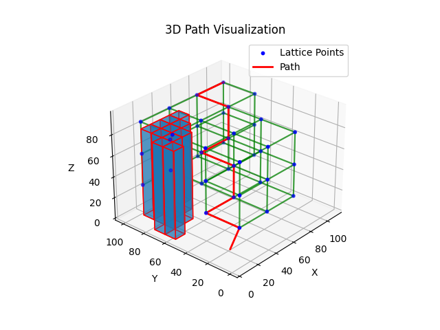
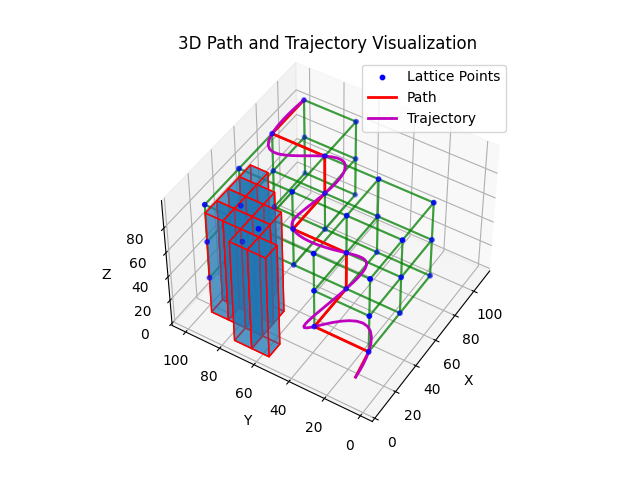

# Motion Planning in 3D

This project demonstrates a 3D motion planning algorithm with trajectory generation for a quadcopter navigating through obstacles. The implementation includes obstacle parsing, lattice construction, pathfinding using A* search, and polynomial trajectory generation. The results are visualized in 3D.

The following images typify the results of the project:

## Description

- **EnvData.cpp/h**: Handles environment data including obstacles.
- **Lattice.cpp/h**: Constructs a lattice for pathfinding.
- **main.cpp**: Main program that integrates obstacle parsing, lattice creation, pathfinding, and trajectory generation.
- **trajectory.cpp/h**: Generates polynomial trajectories from waypoints.
- **show_lattice.py**: Visualizes the lattice and obstacles.
- **show_path.py**: Visualizes the path found by the A* algorithm.
- **show_trajectory.py**: Visualizes the trajectory generated for the path.
- **telemetry_data_processor.py**: Processes telemetry data (additional functionality).

## Usage

1. **Compile the project**:
   Open the solution `motion-planning-controls.sln` in your preferred IDE (e.g., Visual Studio) and compile the project.

2. **Run the main program**:
   Execute `main.cpp` to parse obstacles, create a lattice, find a path using A*, and generate a trajectory.

3. **Visualize the results**:
   Use the provided Python scripts to visualize the obstacles, lattice, path, and trajectory.
   - `show_lattice.py`
   - `show_path.py`
   - `show_trajectory.py`

Each run of the main program will generate CSV files that are used by the visualization scripts. Ensure that these scripts are executed after running the main program to see the latest results.

## Notes

- The file `motion-planning-controls.sln` is used to manage the project solution in Visual Studio.
- The name "controls" in the solution file is a misnomer; the project focuses on motion planning and trajectory generation, not control.
